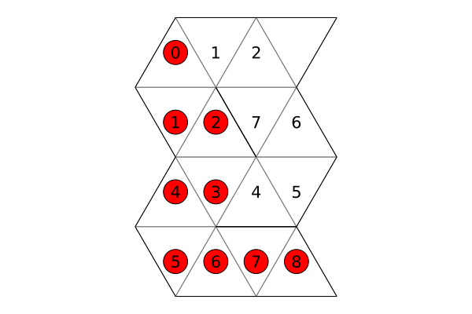
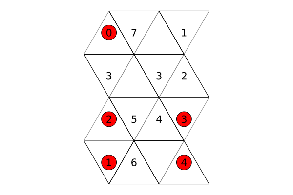
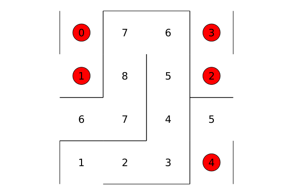
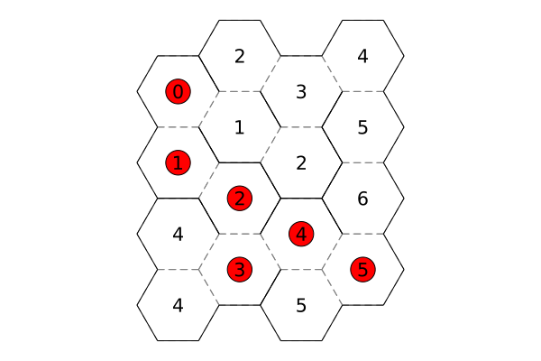
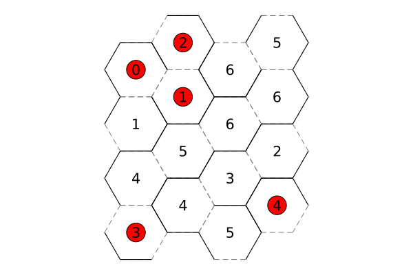

# LabMaze

This repo contains collection of useful functions for generating, solving, and plotting rectangular, triangular, and hexagonal 2D mazes.

Most of the algorithms implemented in this repository are adapted from the excellent book, [Mazes for Programmers](https://pragprog.com/titles/jbmaze/mazes-for-programmers/) by Jamis Buck.

## Examples
### Triangular grid (solved using A*)

### Periodic triangular grid (solved using A*)

### Rectangular grid (solved using Dijkstra)

### Periodic rectangular grid (solved using Dijkstra)

### Hex grid (solved using Dijkstra)

### Periodic Hex grid (solved using Dijkstra)

